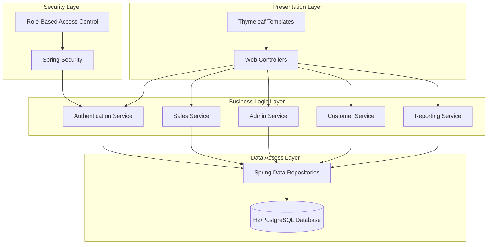
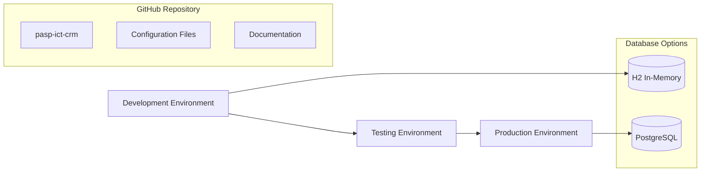
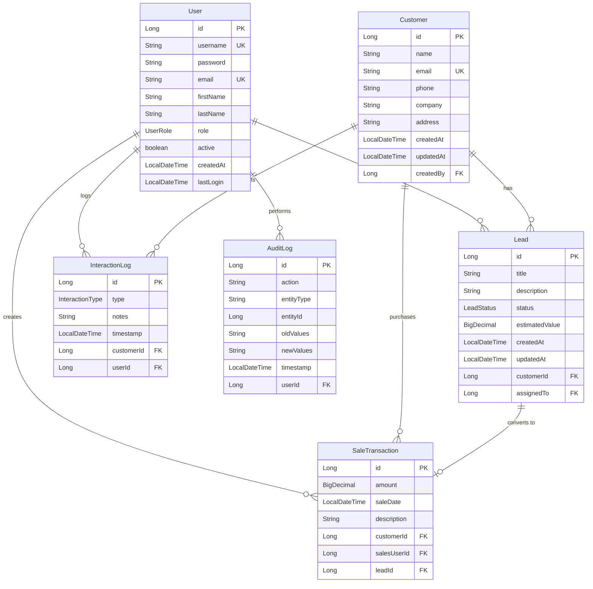

# Design Document: Sales CRM Application

## Overview

The Sales CRM Application is a comprehensive web-based customer relationship management system built with Spring Boot and Thymeleaf. The system provides role-based access control, sales pipeline management, customer data management, and administrative functionality. The architecture supports scalable deployment with H2 database for development and a clear migration path to PostgreSQL for production environments.

### Key Design Principles

- **Security First**: Role-based access control with secure authentication and data encryption
- **Scalability**: Database-agnostic design supporting migration from H2 to PostgreSQL
- **Maintainability**: Clean separation of concerns using Spring Boot's layered architecture
- **User Experience**: Responsive web interface with intuitive navigation and real-time feedback
- **Performance**: Optimized database queries and connection pooling for efficient operations

## Architecture

### System Architecture Overview

The Sales CRM Application follows a traditional three-tier web application architecture:



### Technology Stack

- **Framework**: Spring Boot 3.x with embedded Tomcat
- **Template Engine**: Thymeleaf for server-side rendering
- **Security**: Spring Security for authentication and authorization
- **Database**: H2 (development) with PostgreSQL migration support
- **ORM**: Spring Data JPA with Hibernate
- **Build Tool**: Maven for dependency management and build automation
- **Testing**: JUnit 5, Mockito, and Spring Boot Test

### Deployment Architecture



## Components and Interfaces

### Core Components

#### 1. Authentication Service
**Responsibility**: User authentication, session management, and security enforcement

**Key Methods**:
- `authenticateUser(username, password): AuthenticationResult`
- `createSession(user): Session`
- `validateSession(sessionId): boolean`
- `logAuthenticationAttempt(username, success, timestamp)`

**Dependencies**: UserRepository, PasswordEncoder, SessionManager

#### 2. Sales Service
**Responsibility**: Lead management, sales pipeline, and transaction processing

**Key Methods**:
- `createLead(leadData): Lead`
- `updateLeadStatus(leadId, status): Lead`
- `convertLeadToSale(leadId, saleData): SaleTransaction`
- `calculateSalesMetrics(userId, dateRange): SalesMetrics`

**Dependencies**: LeadRepository, SaleTransactionRepository, CustomerRepository

#### 3. Admin Service
**Responsibility**: User management, system configuration, and administrative functions

**Key Methods**:
- `createUser(userData): User`
- `updateUserRole(userId, role): User`
- `deactivateUser(userId): boolean`
- `getSystemStatistics(): SystemStats`

**Dependencies**: UserRepository, RoleRepository, AuditLogRepository

#### 4. Customer Service
**Responsibility**: Customer data management and interaction history

**Key Methods**:
- `createCustomer(customerData): Customer`
- `searchCustomers(criteria): List<Customer>`
- `updateCustomer(customerId, data): Customer`
- `logInteraction(customerId, interaction): InteractionLog`

**Dependencies**: CustomerRepository, InteractionLogRepository

#### 5. Reporting Service
**Responsibility**: Report generation, analytics, and data visualization

**Key Methods**:
- `generateSalesReport(criteria): SalesReport`
- `exportReport(reportId, format): byte[]`
- `getDashboardMetrics(): DashboardData`
- `getPerformanceAnalytics(dateRange): AnalyticsData`

**Dependencies**: SaleTransactionRepository, LeadRepository, CustomerRepository

### Web Controllers

#### 1. AuthController
- `/login` - User authentication
- `/logout` - Session termination
- `/register` - New user registration (admin only)

#### 2. DashboardController
- `/dashboard` - Role-specific dashboard
- `/dashboard/metrics` - Real-time metrics API

#### 3. SalesController
- `/sales/leads` - Lead management interface
- `/sales/leads/{id}` - Individual lead details
- `/sales/transactions` - Sales transaction history
- `/sales/pipeline` - Sales pipeline view

#### 4. AdminController
- `/admin/users` - User management
- `/admin/system` - System configuration
- `/admin/reports` - Administrative reports

#### 5. CustomerController
- `/customers` - Customer listing and search
- `/customers/{id}` - Customer profile and history
- `/customers/interactions` - Interaction logging

## Data Models

### Entity Relationship Diagram



### Enumerations

#### UserRole
- `ADMIN` - Full system access
- `SALES` - Sales operations and customer management
- `REGULAR` - Read-only access to assigned data

#### LeadStatus
- `NEW` - Initial lead creation
- `CONTACTED` - First contact made
- `QUALIFIED` - Lead meets criteria
- `PROPOSAL` - Proposal sent
- `NEGOTIATION` - In negotiation phase
- `CLOSED_WON` - Successfully converted
- `CLOSED_LOST` - Lost opportunity

#### InteractionType
- `CALL` - Phone conversation
- `EMAIL` - Email communication
- `MEETING` - In-person or virtual meeting
- `NOTE` - General note or update

### Database Schema Considerations

#### H2 Configuration
```sql
-- Development database configuration
spring.datasource.url=jdbc:h2:mem:crmdb
spring.datasource.driver-class-name=org.h2.Driver
spring.jpa.database-platform=org.hibernate.dialect.H2Dialect
```

#### PostgreSQL Migration Configuration
```sql
-- Production database configuration
spring.datasource.url=jdbc:postgresql://localhost:5432/crmdb
spring.datasource.driver-class-name=org.postgresql.Driver
spring.jpa.database-platform=org.hibernate.dialect.PostgreSQLDialect
```

#### Migration Strategy
1. **Schema Compatibility**: Use JPA annotations that work with both H2 and PostgreSQL
2. **Data Types**: Avoid database-specific types in entity definitions
3. **Constraints**: Define constraints through JPA rather than database-specific DDL
4. **Indexing**: Use JPA index annotations for cross-database compatibility

## Correctness Properties

*A property is a characteristic or behavior that should hold true across all valid executions of a system-essentially, a formal statement about what the system should do. Properties serve as the bridge between human-readable specifications and machine-verifiable correctness guarantees.*

After analyzing the acceptance criteria, I identified several redundancies that can be consolidated:
- Authentication properties (1.1, 1.2) can be combined into a comprehensive authentication property
- Role-based access properties (2.2, 2.3, 2.4, 2.5) can be consolidated into a single access control property
- Lead management properties (3.1, 3.2, 3.3, 3.5) share common lead lifecycle behavior
- Data storage properties (7.1, 7.3, 7.5) all relate to data persistence and audit logging

### Property 1: Authentication Validation

*For any* user credentials, the authentication service should create a session if and only if the credentials are valid, and should log every authentication attempt with timestamp and user identifier.

**Validates: Requirements 1.1, 1.2, 1.5**

### Property 2: Password Complexity Enforcement

*For any* password string, the system should accept it if and only if it contains at least 8 characters with mixed case letters and numbers.

**Validates: Requirements 1.3**

### Property 3: Session Timeout Management

*For any* authenticated session, after 30 minutes of inactivity, the system should require re-authentication before allowing further operations.

**Validates: Requirements 1.4**

### Property 4: Role-Based Access Control

*For any* user and system feature, access should be granted if and only if the user's role has permission for that feature (Admin: all features, Sales: sales and customer features, Regular: read-only assigned data).

**Validates: Requirements 2.2, 2.3, 2.4, 2.5**

### Property 5: Lead Lifecycle Management

*For any* lead created by a sales user, the system should store it with timestamp and assigned user, allow status updates through valid transitions, and automatically set status to Closed-Won when converted to a sale.

**Validates: Requirements 3.1, 3.2, 3.5**

### Property 6: Sales Transaction Creation

*For any* completed sale by a sales user, the system should create a sale transaction record containing customer details, amount, and completion date.

**Validates: Requirements 3.3**

### Property 7: Sales Metrics Calculation

*For any* set of sales data, the system should calculate accurate metrics including total revenue, conversion rates, and individual performance based on the underlying transaction data.

**Validates: Requirements 3.4**

### Property 8: User Account Management

*For any* user account operation (create, modify, deactivate) performed by an admin, the system should execute the operation and reflect the changes in user access permissions.

**Validates: Requirements 4.1, 4.3**

### Property 9: System Statistics Display

*For any* system state, the admin dashboard should display accurate statistics including active users, sales volume, and performance metrics based on current data.

**Validates: Requirements 4.4**

### Property 10: Database Schema Compatibility

*For any* data operation, the system should execute successfully on both H2 and PostgreSQL databases with identical results.

**Validates: Requirements 5.2**

### Property 11: Input Validation and Error Handling

*For any* invalid user input, the system should reject the input, display appropriate error messages, and prevent security vulnerabilities like SQL injection and XSS attacks.

**Validates: Requirements 6.4, 9.4**

### Property 12: Customer Data Management

*For any* customer data operation (create, update, search), the system should store complete information, prevent duplicates based on email/company validation, and maintain audit logs with user identifier and timestamp.

**Validates: Requirements 7.1, 7.3, 7.4, 7.5**

### Property 13: Report Generation and Export

*For any* report request with valid criteria, the system should generate accurate reports showing revenue by specified dimensions and allow export in PDF and CSV formats.

**Validates: Requirements 8.1, 8.4**

### Property 14: Data Encryption and Security

*For any* sensitive customer data (contact information, financial details), the system should encrypt the data when stored and decrypt it only for authorized access.

**Validates: Requirements 9.1**

### Property 15: Backup and Security Logging

*For any* system operation, the system should create daily backups of all data and log security incidents including unauthorized access attempts with notification to administrators.

**Validates: Requirements 9.2, 9.3**

## Error Handling

### Authentication Errors
- **Invalid Credentials**: Display generic error message to prevent username enumeration
- **Session Timeout**: Redirect to login page with timeout notification
- **Account Lockout**: Implement progressive delays for repeated failed attempts
- **Password Complexity**: Provide clear feedback on password requirements

### Authorization Errors
- **Insufficient Privileges**: Display access denied message and log attempt
- **Role Changes**: Invalidate existing sessions when user roles are modified
- **Feature Access**: Gracefully handle unauthorized feature access attempts

### Data Validation Errors
- **Required Fields**: Highlight missing required fields with clear messages
- **Format Validation**: Provide specific guidance for email, phone, and date formats
- **Duplicate Detection**: Inform users of existing records and offer merge options
- **Data Integrity**: Prevent orphaned records and maintain referential integrity

### System Errors
- **Database Connectivity**: Implement retry logic and graceful degradation
- **Transaction Failures**: Rollback incomplete transactions and notify users
- **Performance Issues**: Implement timeouts and provide progress indicators
- **Backup Failures**: Alert administrators and maintain backup logs

### Error Logging Strategy
- **Structured Logging**: Use consistent log format with severity levels
- **Error Correlation**: Include correlation IDs for tracking related errors
- **Sensitive Data**: Exclude passwords and personal data from logs
- **Monitoring Integration**: Support integration with monitoring systems

## Testing Strategy

### Dual Testing Approach

The Sales CRM Application will implement both unit testing and property-based testing to ensure comprehensive coverage and correctness validation.

#### Unit Testing
Unit tests will focus on:
- **Specific Examples**: Concrete test cases that demonstrate correct behavior for known inputs
- **Edge Cases**: Boundary conditions like empty datasets, maximum values, and null inputs
- **Integration Points**: Controller-service interactions, database operations, and security integrations
- **Error Conditions**: Exception handling, validation failures, and system error scenarios

#### Property-Based Testing
Property tests will focus on:
- **Universal Properties**: Behaviors that must hold for all valid inputs using randomized test data
- **Comprehensive Coverage**: Testing with generated data to discover edge cases not covered by unit tests
- **Correctness Validation**: Verifying that each design property holds across all possible inputs

### Property-Based Testing Configuration

**Framework**: We will use **jqwik** for Java property-based testing, which integrates well with JUnit 5 and Spring Boot Test.

**Test Configuration**:
- **Minimum Iterations**: Each property test will run for at least 100 iterations to ensure statistical confidence
- **Property Tagging**: Each test will include a comment referencing its corresponding design property
- **Tag Format**: `// Feature: sales-crm-application, Property {number}: {property_text}`

**Example Property Test Structure**:
```java
@Property
@Tag("Feature: sales-crm-application, Property 1: Authentication Validation")
void authenticationValidation(@ForAll("validCredentials") Credentials valid,
                            @ForAll("invalidCredentials") Credentials invalid) {
    // Test that valid credentials create session, invalid don't
}
```

### Test Coverage Requirements
- **Unit Test Coverage**: Minimum 80% line coverage for all service and controller classes
- **Property Test Coverage**: All 15 design properties must have corresponding property-based tests
- **Integration Test Coverage**: End-to-end scenarios covering complete user workflows
- **Security Test Coverage**: Authentication, authorization, and input validation scenarios

### Testing Environment Setup
- **H2 Test Database**: In-memory database for fast test execution
- **Test Data Generation**: Automated generation of test customers, leads, and sales data
- **Mock External Dependencies**: Mock email services, backup systems, and external APIs
- **Performance Baselines**: Establish performance benchmarks for critical operations

The combination of unit tests and property-based tests ensures both concrete correctness validation and comprehensive input coverage, providing confidence in the system's reliability and robustness.