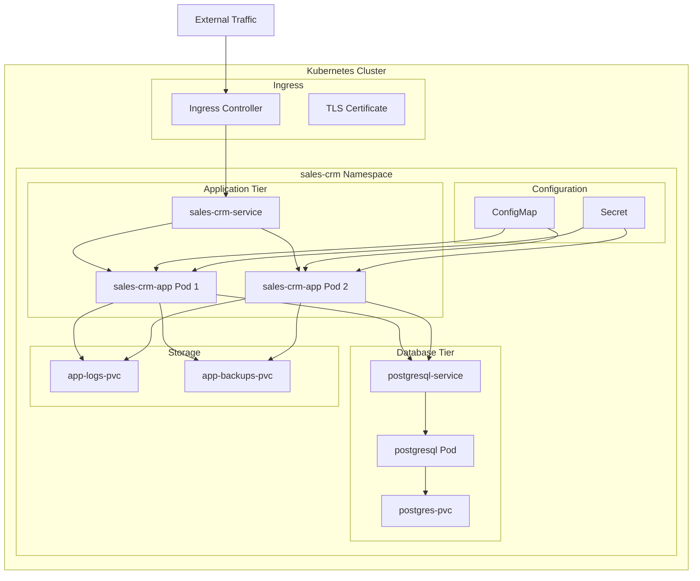

# Kubernetes Deployment Guide

## Overview

This guide provides comprehensive instructions for deploying the Sales CRM Application on Kubernetes clusters. The deployment includes PostgreSQL database, application containers, persistent storage, and ingress configuration.

## Prerequisites

### System Requirements
- **Kubernetes Cluster**: Version 1.20 or higher
- **kubectl**: Configured to access your cluster
- **Storage Class**: Available storage class for persistent volumes
- **Ingress Controller**: NGINX ingress controller (optional, for external access)
- **Cert Manager**: For SSL certificates (optional)

### Resource Requirements
- **CPU**: 1 core minimum, 2 cores recommended
- **Memory**: 2GB minimum, 4GB recommended
- **Storage**: 35GB minimum (10GB database + 5GB logs + 20GB backups)

## Deployment Architecture



## Quick Start

### 1. Clone Repository and Navigate to k8s Directory
```bash
git clone https://github.com/sikhumbuzot-blip/pasp-ict-crm.git
cd pasp-ict-crm/k8s
```

### 2. Update Configuration
```bash
# Update secrets with your actual values
nano secret.yaml

# Update domain name in ingress (if using)
nano ingress.yaml

# Update ConfigMap if needed
nano configmap.yaml
```

### 3. Deploy Application
```bash
# Make deployment script executable
chmod +x deploy.sh

# Deploy the complete application
./deploy.sh deploy
```

### 4. Access Application
```bash
# Port forward for local access
kubectl port-forward service/sales-crm-service 8080:80 -n sales-crm

# Access at http://localhost:8080
```

## Detailed Deployment Steps

### Step 1: Prepare Configuration Files

#### Update Secrets
Edit `secret.yaml` and replace the base64 encoded values:

```bash
# Generate base64 encoded values
echo -n "your_secure_password" | base64
echo -n "your_32_character_encryption_key" | base64
echo -n "your_admin_password" | base64
```

Update the secret.yaml file:
```yaml
data:
  DB_PASSWORD: <your_base64_encoded_db_password>
  ENCRYPTION_KEY: <your_base64_encoded_encryption_key>
  ADMIN_PASSWORD: <your_base64_encoded_admin_password>
  MAIL_PASSWORD: <your_base64_encoded_mail_password>
  NOTIFICATION_ADMIN_EMAILS: <your_base64_encoded_admin_emails>
```

#### Update Ingress (Optional)
If you want external access, update `ingress.yaml`:
```yaml
spec:
  tls:
  - hosts:
    - your-actual-domain.com  # Replace with your domain
    secretName: sales-crm-tls
  rules:
  - host: your-actual-domain.com  # Replace with your domain
```

### Step 2: Deploy Components

#### Deploy Namespace
```bash
kubectl apply -f namespace.yaml
```

#### Deploy Configuration
```bash
kubectl apply -f configmap.yaml
kubectl apply -f postgres-init-configmap.yaml
kubectl apply -f secret.yaml
```

#### Deploy Storage
```bash
kubectl apply -f postgresql-pvc.yaml
kubectl apply -f sales-crm-pvc.yaml
```

#### Deploy Database
```bash
kubectl apply -f postgresql-deployment.yaml

# Wait for database to be ready
kubectl wait --for=condition=available --timeout=300s deployment/postgresql -n sales-crm
```

#### Deploy Application
```bash
kubectl apply -f sales-crm-deployment.yaml

# Wait for application to be ready
kubectl wait --for=condition=available --timeout=600s deployment/sales-crm-app -n sales-crm
```

#### Deploy Ingress (Optional)
```bash
kubectl apply -f ingress.yaml
```

### Step 3: Verify Deployment

#### Check Pod Status
```bash
kubectl get pods -n sales-crm
```

Expected output:
```
NAME                             READY   STATUS    RESTARTS   AGE
postgresql-xxxxxxxxxx-xxxxx     1/1     Running   0          5m
sales-crm-app-xxxxxxxxxx-xxxxx  1/1     Running   0          3m
sales-crm-app-xxxxxxxxxx-xxxxx  1/1     Running   0          3m
```

#### Check Services
```bash
kubectl get services -n sales-crm
```

#### Check Persistent Volumes
```bash
kubectl get pvc -n sales-crm
```

## Configuration Reference

### Environment Variables

The application uses the following environment variables configured through ConfigMap and Secret:

#### ConfigMap Variables
- `SPRING_PROFILES_ACTIVE`: Active Spring profile (prod)
- `DB_HOST`: Database host (postgresql-service)
- `DB_PORT`: Database port (5432)
- `DB_NAME`: Database name (crmdb)
- `DB_USERNAME`: Database username (crmuser)
- `BACKUP_DIRECTORY`: Backup storage directory
- `BACKUP_RETENTION_DAYS`: Days to retain backups
- `BACKUP_ENABLED`: Enable/disable backups
- `NOTIFICATION_ENABLED`: Enable notifications
- `NOTIFICATION_SYSTEM_NAME`: System name in notifications
- `MAIL_HOST`: SMTP server host
- `MAIL_PORT`: SMTP server port

#### Secret Variables
- `DB_PASSWORD`: Database password
- `ENCRYPTION_KEY`: 32-character encryption key
- `ADMIN_PASSWORD`: Default admin password
- `MAIL_PASSWORD`: SMTP password
- `NOTIFICATION_ADMIN_EMAILS`: Admin notification emails

### Resource Limits

#### Application Container
```yaml
resources:
  requests:
    memory: "512Mi"
    cpu: "250m"
  limits:
    memory: "1Gi"
    cpu: "500m"
```

#### PostgreSQL Container
```yaml
resources:
  requests:
    memory: "256Mi"
    cpu: "250m"
  limits:
    memory: "512Mi"
    cpu: "500m"
```

### Storage Configuration

#### Database Storage
- **Size**: 10Gi
- **Access Mode**: ReadWriteOnce
- **Storage Class**: standard (configurable)

#### Application Logs
- **Size**: 5Gi
- **Access Mode**: ReadWriteOnce
- **Storage Class**: standard (configurable)

#### Application Backups
- **Size**: 20Gi
- **Access Mode**: ReadWriteOnce
- **Storage Class**: standard (configurable)

## Scaling and High Availability

### Horizontal Scaling

#### Scale Application
```bash
# Scale to 3 replicas
kubectl scale deployment/sales-crm-app --replicas=3 -n sales-crm

# Verify scaling
kubectl get pods -n sales-crm
```

#### Auto-scaling (Optional)
Create a Horizontal Pod Autoscaler:
```yaml
apiVersion: autoscaling/v2
kind: HorizontalPodAutoscaler
metadata:
  name: sales-crm-hpa
  namespace: sales-crm
spec:
  scaleTargetRef:
    apiVersion: apps/v1
    kind: Deployment
    name: sales-crm-app
  minReplicas: 2
  maxReplicas: 10
  metrics:
  - type: Resource
    resource:
      name: cpu
      target:
        type: Utilization
        averageUtilization: 70
  - type: Resource
    resource:
      name: memory
      target:
        type: Utilization
        averageUtilization: 80
```

### Database High Availability

For production environments, consider:
- **PostgreSQL Cluster**: Use PostgreSQL operators like Zalando Postgres Operator
- **External Database**: Use managed database services (AWS RDS, Google Cloud SQL, Azure Database)
- **Backup Strategy**: Implement automated backups with point-in-time recovery

## Monitoring and Logging

### Application Monitoring

#### Health Checks
```bash
# Check application health
kubectl exec -it deployment/sales-crm-app -n sales-crm -- curl http://localhost:8080/actuator/health

# Port forward and check locally
kubectl port-forward service/sales-crm-service 8080:80 -n sales-crm
curl http://localhost:8080/actuator/health
```

#### View Logs
```bash
# View application logs
kubectl logs -f deployment/sales-crm-app -n sales-crm

# View database logs
kubectl logs -f deployment/postgresql -n sales-crm

# View logs from specific pod
kubectl logs -f <pod-name> -n sales-crm
```

### Metrics Collection (Optional)

Deploy Prometheus and Grafana for comprehensive monitoring:

```yaml
# prometheus-config.yaml
apiVersion: v1
kind: ConfigMap
metadata:
  name: prometheus-config
  namespace: sales-crm
data:
  prometheus.yml: |
    global:
      scrape_interval: 15s
    scrape_configs:
    - job_name: 'sales-crm'
      kubernetes_sd_configs:
      - role: pod
        namespaces:
          names:
          - sales-crm
      relabel_configs:
      - source_labels: [__meta_kubernetes_pod_annotation_prometheus_io_scrape]
        action: keep
        regex: true
```

## Backup and Recovery

### Database Backup

#### Manual Backup
```bash
# Create backup
kubectl exec -it deployment/postgresql -n sales-crm -- pg_dump -U crmuser -d crmdb > backup.sql

# Copy backup from pod
kubectl cp sales-crm/postgresql-pod-name:/tmp/backup.sql ./backup.sql
```

#### Automated Backup Job
```yaml
apiVersion: batch/v1
kind: CronJob
metadata:
  name: postgres-backup
  namespace: sales-crm
spec:
  schedule: "0 2 * * *"  # Daily at 2 AM
  jobTemplate:
    spec:
      template:
        spec:
          containers:
          - name: postgres-backup
            image: postgres:15-alpine
            command:
            - /bin/bash
            - -c
            - |
              pg_dump -h postgresql-service -U crmuser -d crmdb > /backups/backup-$(date +%Y%m%d-%H%M%S).sql
              find /backups -name "backup-*.sql" -mtime +30 -delete
            env:
            - name: PGPASSWORD
              valueFrom:
                secretKeyRef:
                  name: sales-crm-secrets
                  key: DB_PASSWORD
            volumeMounts:
            - name: backup-storage
              mountPath: /backups
          volumes:
          - name: backup-storage
            persistentVolumeClaim:
              claimName: app-backups-pvc
          restartPolicy: OnFailure
```

### Application Data Backup

The application automatically creates backups in the `/app/backups` directory, which is mounted to a persistent volume.

## Security Considerations

### Network Security
- Use NetworkPolicies to restrict pod-to-pod communication
- Configure ingress with TLS termination
- Use private container registries

### Secret Management
- Use Kubernetes secrets for sensitive data
- Consider external secret management (HashiCorp Vault, AWS Secrets Manager)
- Rotate secrets regularly

### Pod Security
- Use non-root containers
- Implement Pod Security Standards
- Use read-only root filesystems where possible

### Example NetworkPolicy
```yaml
apiVersion: networking.k8s.io/v1
kind: NetworkPolicy
metadata:
  name: sales-crm-network-policy
  namespace: sales-crm
spec:
  podSelector:
    matchLabels:
      app: sales-crm-app
  policyTypes:
  - Ingress
  - Egress
  ingress:
  - from:
    - namespaceSelector:
        matchLabels:
          name: ingress-nginx
    ports:
    - protocol: TCP
      port: 8080
  egress:
  - to:
    - podSelector:
        matchLabels:
          app: postgresql
    ports:
    - protocol: TCP
      port: 5432
```

## Troubleshooting

### Common Issues

#### Pod Startup Issues
```bash
# Check pod status
kubectl get pods -n sales-crm

# Describe pod for events
kubectl describe pod <pod-name> -n sales-crm

# Check pod logs
kubectl logs <pod-name> -n sales-crm
```

#### Database Connection Issues
```bash
# Test database connectivity
kubectl exec -it deployment/sales-crm-app -n sales-crm -- nc -zv postgresql-service 5432

# Check database logs
kubectl logs deployment/postgresql -n sales-crm

# Connect to database directly
kubectl exec -it deployment/postgresql -n sales-crm -- psql -U crmuser -d crmdb
```

#### Storage Issues
```bash
# Check PVC status
kubectl get pvc -n sales-crm

# Check storage class
kubectl get storageclass

# Describe PVC for events
kubectl describe pvc <pvc-name> -n sales-crm
```

#### Ingress Issues
```bash
# Check ingress status
kubectl get ingress -n sales-crm

# Describe ingress
kubectl describe ingress sales-crm-ingress -n sales-crm

# Check ingress controller logs
kubectl logs -n ingress-nginx deployment/ingress-nginx-controller
```

### Performance Troubleshooting

#### Resource Usage
```bash
# Check resource usage
kubectl top pods -n sales-crm
kubectl top nodes

# Check resource limits
kubectl describe pod <pod-name> -n sales-crm
```

#### Database Performance
```bash
# Connect to database and check performance
kubectl exec -it deployment/postgresql -n sales-crm -- psql -U crmuser -d crmdb

# Check active connections
SELECT count(*) FROM pg_stat_activity WHERE state = 'active';

# Check database size
SELECT pg_size_pretty(pg_database_size('crmdb'));
```

## Maintenance

### Updates and Upgrades

#### Application Updates
```bash
# Update application image
kubectl set image deployment/sales-crm-app sales-crm=sales-crm:new-version -n sales-crm

# Check rollout status
kubectl rollout status deployment/sales-crm-app -n sales-crm

# Rollback if needed
kubectl rollout undo deployment/sales-crm-app -n sales-crm
```

#### Database Updates
```bash
# Backup before update
kubectl exec -it deployment/postgresql -n sales-crm -- pg_dump -U crmuser -d crmdb > pre-update-backup.sql

# Update PostgreSQL image
kubectl set image deployment/postgresql postgresql=postgres:16-alpine -n sales-crm
```

### Cleanup

#### Remove Deployment
```bash
# Using the deployment script
./deploy.sh clean

# Manual cleanup
kubectl delete namespace sales-crm
```

#### Remove Persistent Data
```bash
# Delete PVCs (this will delete all data)
kubectl delete pvc --all -n sales-crm
```

## Production Considerations

### Resource Planning
- Monitor resource usage and adjust limits accordingly
- Plan for peak usage scenarios
- Consider node affinity and anti-affinity rules

### Backup Strategy
- Implement automated daily backups
- Test backup restoration procedures
- Store backups in multiple locations

### Monitoring and Alerting
- Set up comprehensive monitoring
- Configure alerts for critical metrics
- Monitor application and infrastructure health

### Security Hardening
- Regular security updates
- Network segmentation
- Access control and audit logging

## Conclusion

This Kubernetes deployment guide provides a comprehensive approach to deploying the Sales CRM Application in a containerized environment. The configuration supports scaling, high availability, and production-ready deployments.

For additional support:
- Review application logs for troubleshooting
- Check Kubernetes events for cluster-level issues
- Consult the main [DEPLOYMENT_GUIDE.md](DEPLOYMENT_GUIDE.md) for alternative deployment methods